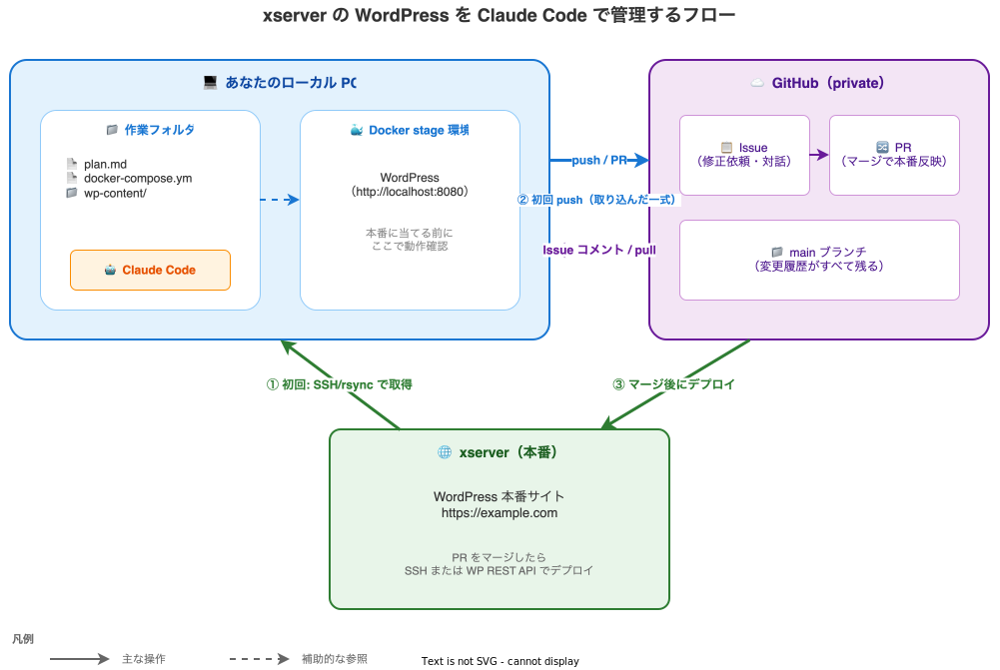

# 1. ゴールと全体フロー

このページを読むと、**この事例で目指すゴール** と、これから作っていくフローの全体像が掴めます。

## ゴール

xserver でホスティングしている既存の WordPress サイトに対して、次のような運用ができる状態を作ります。

- **修正指示は GitHub Issue で受け取る**: メールや口頭ではなく、Issue に書かれた内容を Claude Code が読んで作業する
- **修正は stage 環境で先に確認する**: 本番（xserver）にいきなり当てず、ローカル PC の Docker で先に動作確認
- **本番反映は PR マージ後**: GitHub の PR をマージしたタイミングで xserver にデプロイ
- **すべての変更履歴が残る**: 「いつ・誰が・何を」変えたかが GitHub にすべて記録される

## なぜこのフローにするのか

WordPress の管理画面から直接編集する従来のやり方と比べた利点です。

| | 管理画面で直接編集 | このフロー |
|---|---|---|
| **失敗したときの戻し方** | 手動で元に戻す | GitHub から **ワンコマンドで戻せる** |
| **stage での事前確認** | できない（本番一発勝負） | 必ず **ローカルで確認してから本番** |
| **複数人での作業** | 同時編集すると衝突 | Issue・PR で **整理された対話** |
| **作業の記録** | 残らない | **すべて Issue・PR に残る** |
| **AI による支援** | 限定的 | **Claude Code が代行** できる |

## 全体フロー

## 各章で作っていくもの

| 段階 | 章 | 作るもの |
|------|----|---------|
| **準備** | [2](02-prepare-folder.md)・[3](03-github-repo.md) | 作業フォルダ・`plan.md`・GitHub private リポジトリ |
| **指示出し** | [4](04-issue-creation.md) | `plan.md` の内容を Issue 化 |
| **対話** | [5](05-issue-dialogue.md) | Issue コメントで Claude Code と相談 |
| **stage 構築** | [6](06-stage-docker.md) | Docker で WordPress の動作確認環境 |
| **反映** | [7](07-edit-and-pr.md)・[8](08-deploy-xserver.md) | PR → xserver デプロイ |

!!! tip "セミナー当日の進め方"
    次回のセミナーミーティングでは、このドキュメントを見ながら **実際に手を動かして** いただきます。事前にこのページで全体像を掴んでおくと、当日スムーズに進められます。
