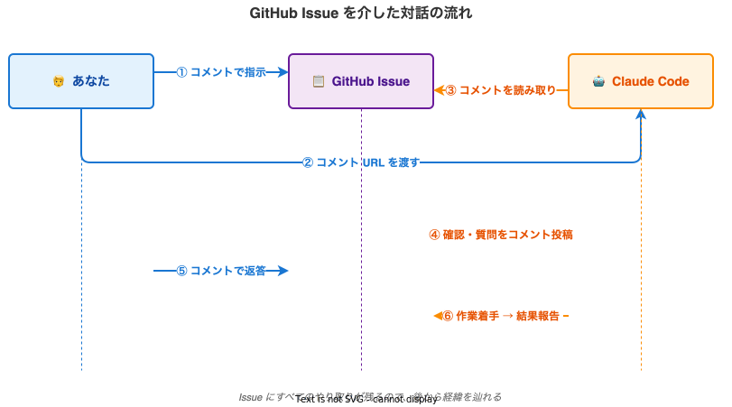

# 5. Issue で対話する

このページを読むと、**GitHub の Issue コメントを通じて Claude Code に作業を依頼・確認できる** ようになります。

## やること

1. Issue コメントで Claude Code に質問・追加指示を出す
2. Claude Code がコメントで返答する
3. コメント URL を Claude Code に渡して、その内容を実行させる

## 対話のスタイル

人とのやり取りと同じです。気を付けるポイントは 2 つだけです。

- **質問・指示はコメントに書く**（Issue 本文ではなく）
- **Claude Code に動いてもらいたいときは「コメント URL」を渡す**

## ステップ 1: コメントで指示を追加する

GitHub の Issue ページを開き、コメント欄に書き込みます。

例:

```
追加で以下もお願いします。

- トップページのキャッチコピーを変更したい
- 現在: 「未来を拓く、確かな技術」
- 変更後: 「お客様と共に歩む、誠実な技術」
```

「Comment」ボタンを押してコメントを投稿します。

## ステップ 2: コメント URL をコピー

投稿したコメントの右上にある日時部分（例: `5 minutes ago`）の右にある `...` メニューから **「Copy link」** を選ぶと、そのコメントへの URL がコピーされます。

URL は次のような形式です。

```
https://github.com/your-username/wp-mysite/issues/1#issuecomment-1234567890
```

## ステップ 3: Claude Code に URL を渡す

ターミナルに戻って Claude Code に伝えます。

> このコメントの内容を読んで対応してください: `https://github.com/your-username/wp-mysite/issues/1#issuecomment-1234567890`

Claude Code は GitHub からそのコメントを読み取り、

- 不明点があれば **Issue にコメント** で質問してくる
- すぐ作業できる内容なら **修正に着手** する

## ステップ 4: Claude Code からの確認に答える

Claude Code が次のようなコメントを Issue に投稿することがあります。

> 確認させてください。
>
> 1. キャッチコピーは `<h1>` タグですか、それとも別のタグですか？
> 2. 変更後のキャッチコピーは、フォントや色も変更しますか？

これに対して、GitHub の Issue ページで **そのままコメントで返答** します。

```
1. <h1> タグです
2. 色やフォントは変更しません、文言だけです
```

## 対話の流れ（イメージ）



## ヒント

!!! tip "Issue ごとに対話を分ける"
    別の修正を始めるときは、新しい Issue を立てます。1 つの Issue に複数の修正を混ぜると、後から見返したときに分かりにくくなります。

!!! tip "コメントには画像も貼れる"
    GitHub のコメント欄に画像をドラッグ&ドロップすると、画像をアップロードできます。「ここをこう変えたい」という説明に使えます。

!!! warning "個人情報・パスワードは書かない"
    GitHub のリポジトリは private でも、絶対に **パスワードや認証情報** を Issue・コメントに書かないでください。SSH 鍵や API キーは別の安全な経路（[8. デプロイ](08-deploy-xserver.md) で説明）で扱います。

## 確認

- [ ] Issue にコメントを書ける
- [ ] コメント URL のコピー方法が分かる
- [ ] Claude Code に URL を渡して対応してもらえる

確認できたら、次の [6. Docker で stage 環境](06-stage-docker.md) に進みます。
