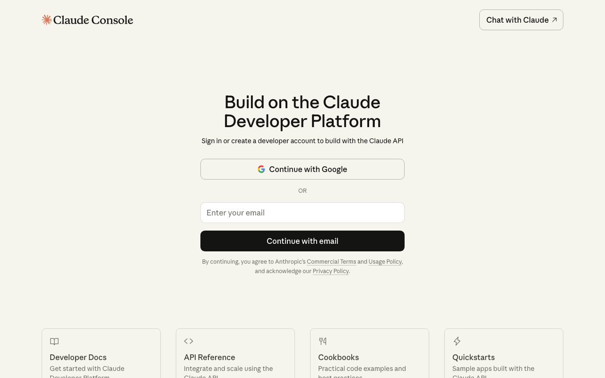

# Part 2: Claude Code インストール

Anthropic のアカウント登録から Claude Code のインストールまでの手順です。

## 2.1 Anthropic アカウントの作成

1. [console.anthropic.com](https://console.anthropic.com/) にアクセス
2. 「Sign Up」からアカウントを作成
3. メールアドレスの確認を完了



## 2.2 Claude Code のインストール

ターミナルで以下のコマンドを実行してください:

```bash
npm install -g @anthropic-ai/claude-code
```

!!! note "権限エラーが出た場合"
    以下のコマンドで再試行してください:
    ```bash
    sudo npm install -g @anthropic-ai/claude-code
    ```
    Mac のログインパスワードを入力してください。

## 2.3 Claude Code の起動と認証

ターミナルで以下のコマンドを実行して Claude Code を起動します:

```bash
claude
```

初回起動時に認証が求められます:

1. ブラウザが自動的に開きます
2. Anthropic アカウントでログインしてください
3. 認証が完了するとターミナルに戻ります

!!! tip "サブスクリプションについて"
    Claude Code を使うには、以下のいずれかが必要です:

    - **Claude Pro プラン**（$20/月）- Claude Web版と使用量を共有
    - **Claude Max プラン**（$100/月 または $200/月）- 大量に使う方におすすめ
    - **API クレジット**（従量課金）

    Pro・Max プランでは Claude Web版と使用量の上限が共有されます。Claude Code を頻繁に使う場合は Max プランがおすすめです。

    詳しくは [claude.ai/pricing](https://claude.ai/pricing) を確認してください。

## 2.4 動作確認

Claude Code が起動したら、簡単な質問をして動作を確認しましょう:

```
こんにちは。今日の日付を教えてください。
```

応答が返ってくれば、インストール成功です。

`/exit` と入力して一旦終了しましょう:

```
/exit
```

## 次のステップ

Claude Code のインストールが完了しました。[Part 3: インストール後の環境準備](part3-post-setup.md) に進んでください。
