# 概要

## Claude Code とは

[Claude Code](https://docs.anthropic.com/en/docs/claude-code) は、Anthropic が提供するターミナルベースの AI アシスタントです。ターミナル上で `claude` コマンドを実行し、日本語で指示を出すだけで、さまざまな作業を自動化できます。

一般的な AI チャットとの違いは、**あなたのパソコン上のファイルを直接操作できる**ことです。ファイルの作成・編集、フォルダ整理、GitHub への公開まで、指示するだけで実行してくれます。

## Claude Code でできること

| カテゴリ | 具体例 |
|----------|--------|
| **ドキュメント作成** | 提案書、計画書、企画書のテンプレート作成・編集 |
| **ポートフォリオ** | 写真やクリエイティブ作品の公開サイト構築 |
| **就職活動** | 履歴書・職務経歴書の作成・整理 |
| **調査・整理** | 調べ物のまとめ、思考の構造化 |
| **行政手続き** | 確定申告の書類整理、提出書類のチェック |
| **ファイル管理** | フォルダ分け、ファイル名の一括変更 |

## 本ガイドの構成

このガイドでは、新しい MacBook に Claude Code をインストールし、日常的に使える状態にするまでを 3 パートで案内します。

### 構成図

以下の図は、セットアップ後の全体構成を示しています。

- **あなたの MacBook** 上に Claude Code をインストールし、ターミナルから操作します
- Claude Code は **Claude API** と通信して AI の応答を受け取ります
- 作成したファイルは **GitHub** で管理し、必要に応じて **GitHub Pages** で公開できます
- **スキル** や **CLAUDE.md** で Claude Code の動作をカスタマイズできます

### セットアップの流れ

## この構成の利点

### 1. コマンド操作を覚えなくてよい

Claude Code に日本語で指示するだけで、必要なコマンドを代わりに実行してくれます。

### 2. 作業の履歴が残る

GitHub でファイルを管理するため、いつ・何を変更したかの履歴が自動的に残ります。間違えても元に戻せます。

### 3. どこからでもアクセスできる

GitHub に保存したファイルは Web からいつでも確認できます。GitHub Pages を使えば、ポートフォリオなどを簡単に公開できます。

### 4. スキルで作業を定型化できる

よく使う操作を「スキル」として登録しておけば、`/スキル名` と入力するだけで複雑な作業を実行できます。
