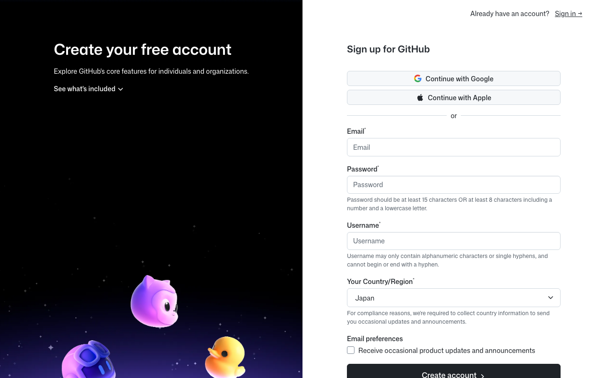
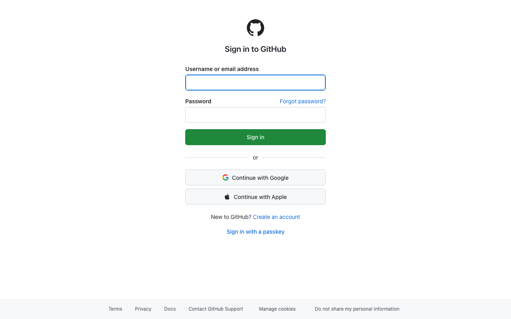

# Part 1: 事前準備

Claude Code をインストールする前に必要なツールをセットアップします。

## 1.1 ターミナルを開く



!!! tip "ターミナルとは"
    ターミナルは Mac に標準で入っているアプリで、テキストでコマンドを入力してパソコンを操作できます。
    この手順書では、ターミナルにコマンドをコピー＆ペーストして実行していきます。

## 1.2 Homebrew のインストール

Homebrew は Mac 用のパッケージマネージャーです。各種ツールのインストールに使います。

ターミナルで以下のコマンドをコピー＆ペーストして実行してください:

```bash
/bin/bash -c "$(curl -fsSL https://raw.githubusercontent.com/Homebrew/install/HEAD/install.sh)"
```

!!! note "パスワードを聞かれたら"
    Mac のログインパスワードを入力してください。入力中は画面に何も表示されませんが、正常です。

!!! info "Command Line Tools のインストールダイアログが表示されたら"
    Homebrew のインストール中に、以下のようなダイアログが表示されることがあります。これは Homebrew が必要とする開発ツール（Command Line Tools）を自動的にインストールするためのものです。**「インストール」をクリック**してください。

    

    インストールには数分かかる場合があります。完了するまでそのまま待ってください。

インストール完了後、表示される「Next steps」の指示に従ってパスを設定してください:

```bash
echo >> ~/.zprofile
echo 'eval "$(/opt/homebrew/bin/brew shellenv)"' >> ~/.zprofile
eval "$(/opt/homebrew/bin/brew shellenv)"
```

正しくインストールされたか確認しましょう。ターミナルで以下のコマンドを実行してください:

```bash
brew --version
```

`Homebrew 4.x.x` のようにバージョン番号が表示されれば成功です。

## 1.3 Git の確認

Homebrew のインストール時に Command Line Tools と一緒に Git も導入されています。ターミナルで以下のコマンドを実行して確認しましょう:

```bash
git --version
```

`git version 2.x.x` のようにバージョンが表示されれば OK です。

## 1.4 GitHub CLI のインストール

GitHub をターミナルから操作するためのツールです。ターミナルで以下のコマンドを実行してください:

```bash
brew install gh
```

## 1.5 GitHub アカウントの作成とログイン

### アカウント作成

まだ GitHub アカウントがない場合は [github.com](https://github.com/) でアカウントを作成してください。



### ログイン

ターミナルで以下のコマンドを実行してください:

```bash
gh auth login
```

対話形式で聞かれるので、以下の図のように選択してください:



ステップ❹でブラウザが開いたら、コードを入力して認証を完了します:



正しくログインできたか確認しましょう。ターミナルで以下のコマンドを実行してください:

```bash
gh auth status
```

「Logged in to github.com」と表示されれば成功です。

## 1.6 Node.js のインストール

Claude Code の実行に Node.js が必要です。ターミナルで以下のコマンドを実行してください:

```bash
brew install node
```

正しくインストールされたか確認しましょう。ターミナルで以下のコマンドを実行してください:

```bash
node --version
```

`v18.x.x` 以上のバージョンが表示されれば OK です。

## 次のステップ

事前準備が完了しました。[Part 2: Claude Code インストール](part2-installation.md) に進んでください。
