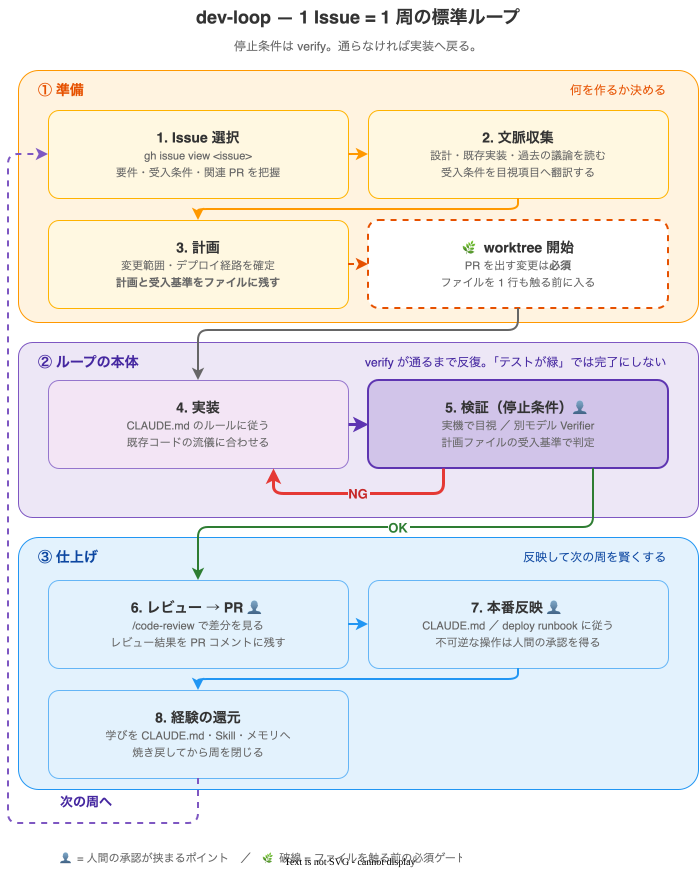

# dev-loop の設計 — ループ志向開発

`dev-loop` プラグインが実装する開発方式（**AI コーディングエージェント前提の反復開発**）の
設計ドキュメント。`/dev-loop` の各ステップが「なぜそうなっているか」をここで定義する。
手順そのものは [プラグイン一覧の dev-loop 節](index.md#dev-loop) と、インストール後の
`SKILL.md` を参照。

!!! quote "背景 — 「プロンプトを打つ」から「ループを書く」へ"
    > もう自分でプロンプトを打つことはない、書いているのは**ループ**だ。

    エージェント開発の要点は、指示を 1 つずつ手で与えることではなく、
    **「何を・どの条件を満たすまで繰り返すか」を設計してエージェントに委ねる**ことにある。

## 1. なぜループ志向か

従来の「1 指示 = 1 応答」は、指示者がボトルネックになる。ループ志向では、開発者は

1. **不変のルール**（`CLAUDE.md`）
2. **繰り返す手順**（Skills — `/dev-loop` はこれ）
3. **停止条件**（検証 = verify が通ること）

の 3 つを一度定義し、あとはエージェントが「実装 → 検証 → 修正」を停止条件に達するまで自走する。
この前提が整うほど、ループに安全に委ねられる。

## 2. ループの心臓は「verify の定義」 { #verify }

ループが空回りしないための鍵は、**停止条件を曖昧にしないこと**。`/dev-loop` は対象リポジトリの
`CLAUDE.md`（および任意の `.claude/dev-loop.md`）から verify の定義を発見し、それをそのまま
ループの停止条件に据える。プロジェクト側で最低限、以下を明文化しておくと効く。

| 局面 | 検証（停止条件）に書くべきこと |
| --- | --- |
| **マージ前** | ロジック変更を**実際に動かして目視確認**する手順（開発サーバ起動・実データ接続・E2E 実行） |
| **本番反映** | 何をマージ／ビルド／apply すると本番に反映されるか（デプロイ経路） |
| **変更種別の分岐** | バックエンド／インフラ／フロント等で経路が分かれるか |
| **フラグ切替** | 設定・環境変数の更新だけで反映できる挙動はどれか（再ビルド不要な近道） |

これらが `CLAUDE.md` に無ければ、`/dev-loop` は**テスト実行＋アプリ起動での手動確認**という
汎用手順に縮退する。

!!! warning "検証を伴わないループは禁止"
    「テストが緑」だけを停止条件にしない。ロジック変更は **実際に動かして挙動を目視**するまで
    完了扱いにしない。停止条件が弱いループは、もっともらしいが誤った結果を通してしまう。

!!! tip "別モデルの Verifier で牽制する"
    実装したエージェントは自分の変更に甘く、ほぼ確実に自己採点が高い。受入条件の充足は
    **実装とは別モデルの Verifier サブエージェント**に判定させる（`Agent` ツールで `model` に
    実装時と別ティア＝例: 実装が Opus なら `sonnet` を指定）。「受入条件◯◯を満たさない反証を、
    証拠（テスト結果・ログ・目視項目）で示せ」と指示し、**反証が挙がれば実装に戻す**。
    同一モデルだと盲点を一緒に見逃すため、モデルを変えるのが要点。

!!! warning "Verifier には Bash を持つ subagent を指定する"
    「証拠で示せ」と指示しても、**その subagent がコマンドを実行できなければ意味がない**。
    テスト・ビルド・`git` を自分で走らせられない agent を指定すると、報告は静的なファイル読解に
    縮退し、肝心の検証が**実装側に差し戻される**。自分の変更に甘い側が検証を担うことになり、
    牽制の目的が半分失われる。

    | 指定するとき | 見るべき点 |
    | --- | --- |
    | **ツール可用性** | `subagent_type` が **Bash を持つか**を先に確認する。レビュー特化の agent は持たないことがある |
    | **既定の選択** | 汎用 agent（例: `general-purpose`）＋**「ファイルを変更するな。検証だけせよ」の明示**。書き込みもできるためガードが要る |
    | **読み取り専用にしたい場合** | `Explore` / `Plan` のように**書き込み権限を持たない** agent（Bash は持つ）。レビュー志向ではない分、指示を厚く書く |
    | **指示に必ず入れる** | 「**コマンドを実行できない場合はその旨を明記せよ**」。黙って縮退した報告を「反証なし」と読み違えないため |

## 3. 反復の道具は 4 つの層で使い分ける { #layers }

粒度に応じて道具を選ぶ。A〜C は「ループ」の層で、上ほど開発の本体・下ほど待ち時間の自動化。
D は**その外側にあるグラフの層**で、1 本のループでは待ちが無駄になるときに移る先。

| 層 | 道具 | 停止条件／構造の書き方 | 使いどころ |
| --- | --- | --- | --- |
| **A. 構造ループ（1 Issue = 1 周）** | `/dev-loop`（＋任意でフェーズ分割型プランニングプラグイン） | Issue 選択 → 計画 → 実装 → verify を Issue 単位で回す | 機能追加・仕様変更の本体 |
| **B. セッション内の反復** | `/loop`（間隔指定 or 自走） | 「CI が緑になるまで」「デプロイ PR がマージされるまで」 | ビルド／CI／デプロイの完了待ち・監視 |
| **C. 定時の自律ループ** | `/schedule`（cron クラウドエージェント） | 「毎朝 inbox を 1 件トリアージ」等 | 定型作業・夜間バッチ結果の点検 |
| **D. グラフ（宣言的な調整構造）** | `Workflow` ツール（動的ワークフロー） | ノードとデータの流れを**一度スクリプトで宣言**し、`parallel()` / `pipeline()` で fan-out させる | 並列読解・多観点レビュー・多数決による検証など、逐次だと待ちが無駄になる場面 |

`/dev-loop` が担うのは **層 A**。B・C は待ち時間や定時処理を切り出す別スキルで、未導入環境では
手動の待機・確認に読み替えてよい。**D は層 A の代替ではない**——[§3.1](#five-layers) のとおり、
ループはグラフの簡易版であって、両者は競合しない。

### 3.1 5 レイヤーの中での位置づけ { #five-layers }

エージェント設計は **プロンプト → コンテキスト → ハーネス → ループ → グラフ** の 5 層で捉えられる。
`/dev-loop` はこのうち**第 4 層（ループ）**の実装で、上の表の層 D が**第 5 層（グラフ）**にあたる。

| 層 | 設計対象 | この文書での実体 |
| --- | --- | --- |
| 1. プロンプト | 1 つの指示の言い方 | 各ステップでエージェントに与える指示 |
| 2. コンテキスト | 判断の瞬間に何を持っているか | [§4](#standard-loop) 手順 2 の文脈収集・手順 3 の計画ファイル |
| 3. ハーネス | 道具・権限・作業環境 | `CLAUDE.md`、worktree、権限設定 |
| 4. ループ | 反復と**停止条件** | **`/dev-loop`（層 A）** ＋ `/loop`（層 B）・`/schedule`（層 C） |
| 5. グラフ | 分岐・並列・承認の経路 | `Workflow` ツール（層 D） |

要点は**この 5 層が競合しない**こと。「ループは単純なグラフに過ぎない」——ループエンジニアリングは
グラフの簡易版であって、置き換えられる関係ではない。1 本の反復で足りるならループのままでよく、
役割分担・並列・承認ゲートが要るようになった時点でグラフへ上げる。

!!! warning "エッジは「その次に」ではなくデータの流れ"
    グラフでは**実際に値が渡るときだけ辺を引く**。「A の次に B」という時間順序で辺を引くと、
    存在しない依存で待ちが生まれる。[§4](#standard-loop) の標準ループは意図的に 1 本の線にして
    あるが、その中には**データを渡していない辺**（例: 手順 2 で複数の資料を読む部分）が含まれる。
    そこが層 D へ上げる余地のある箇所。

参考:

- [AIエージェント設計の5レイヤー — プロンプト・コンテキスト・ハーネス・ループ・グラフは競合しない](https://hdknr.github.io/blogs/posts/2026/07/ai-agent-design-engineering-layers/)
- [Claude Code の動的ワークフローで組むグラフエンジニアリング 14 ステップ](https://hdknr.github.io/blogs/posts/2026/07/graph-engineering-14-step-roadmap/)
- [グラフエンジニアリング（概念）](https://hdknr.github.io/blogs/wiki/concepts/graph-engineering/)

## 4. 1 Issue を 1 周する標準ループ { #standard-loop }

開発本体は **層 A** を基本とする。GitHub Issue 1 件を次のサイクルで 1 周させる。



!!! note "この図はループの図解であり、宣言的グラフではない"
    上の図は手順の流れを人間向けに描いたもので、実行される構造ではない。各ステップは
    `SKILL.md` の散文手順として、エージェントが毎周読み直して解釈する。[§3.1](#five-layers) の
    第 5 層（グラフ）に上げるには、ノードの入出力スキーマとデータの流れを `Workflow`
    スクリプトとして宣言する必要がある。

各ステップの対応:

1. **Issue 選択** — `gh issue view <issue-number>` で要件・受入条件・関連 PR を把握する。
2. **文脈収集** — 関連ドキュメント・既存実装・過去の議論を読む。受入条件を「何を目視できれば
   満たしたと言えるか」に翻訳しておく。
3. **計画** — 変更範囲・影響を確定。設定フラグで切替可能かも先に判断（済むなら再ビルドを避けられる）。
   **計画と verify の受入基準はファイルに書き出す**（`docs/plans/issue-<n>.md` 等）。会話コンテキストは
   圧縮で失われるが、ファイルは残る——[§7](#dreaming) の「記録」を計画にも適用する。
4. **実装** — **まず worktree を開始する（PR を出す周では必須）**。そのうえで対象リポジトリの
   `CLAUDE.md` のルールを守り、既存コードの流儀に合わせて変更する。
5. **検証（停止条件）** — [§2](#verify) の verify が通るまで 4↔5 を繰り返す。ここがループの本体。
   判定は手順 3 の計画ファイルに書いた受入基準に照らす（実装しながら基準を緩めない）。
   受入条件の充足は、実装とは **別モデルの Verifier サブエージェント**にも反証を探させて牽制する。
6. **レビュー** — `/code-review` で差分をレビューし、指摘を反映して PR を作成。**worktree 上に
   いることが PR 作成の前提条件**で、そうでなければ worktree へ移送してから作る。結果は PR コメントに残す。
7. **本番反映** — 対象リポジトリの `CLAUDE.md` / deploy runbook の経路に従う。破壊的・不可逆な反映
   （DB マイグレーション・インフラ apply 等）は前提条件を確認し、必要なら人間の承認を得る。
8. **経験の還元** — この 1 周で得た学び（成功の型・失敗の教訓・非自明な事実）を `CLAUDE.md` / 該当
   Skill / メモリへ焼き戻してから周を閉じる。変更は必ず PR で人間レビューを通す。

!!! tip "このループはスキル化されている"
    上記手順は毎回口頭で説明せず、`/dev-loop` に集約している。「ループを一度書いて再利用する」を
    体現する。`/dev-loop <issue>` で起動する。

## 5. 実行例（ウォークスルー） { #walkthrough }

`/dev-loop` で 1 Issue を 1 周させる具体例。ここでは **「一覧 API に新しいフィールドを足し、
フロントにバッジ表示する」**という架空の Issue #999（バックエンド + フロントの小改修）を題材にする。
👤 は **人間の承認が挟まるチェックポイント**を表す。

!!! note "起動"
    ```
    /dev-loop 999
    ```
    以降、プラグインの `SKILL.md` の手順に沿って進む。

### 5.1 Issue 選択・文脈収集

```bash
gh issue view 999               # 要件・受入条件・関連 PR を把握（必須）
```

関連ドキュメントと既存実装（API・フロントの表示箇所）を読む。

### 5.2 計画 — 変更経路を見極める

まず **「設定フラグで済むか / コード変更が要るか」** を判断する。ここが後段のデプロイ経路を決める。

| 判断 | 帰結 |
| --- | --- |
| 設定・環境変数で挙動を切替できる | コード変更なし。フラグ更新 + 再起動で反映 |
| 表示ロジックの追加が要る | バックエンド + フロントの変更 → フル 1 周（本例はこちら） |

判断できたら、**計画を `docs/plans/issue-999.md` に書き出す**。ここに書いた受入基準が 5.4 の
停止条件になる。コンテキストが圧縮された後や翌日の再開時は、このファイルを読み直してから続ける。

```markdown
## 変更範囲
- backend: 一覧 API に `is_new` フィールド追加 / frontend: 一覧行にバッジ
- 触らない: 検索条件・ページング

## デプロイ経路
- コード変更あり → main マージ → CI ビルド → 通常デプロイ

## verify の受入基準（目視項目）
- [ ] 一覧画面で、新規レコードにだけバッジが出る
- [ ] 既存レコードにはバッジが出ない（回帰なし）

## 未解決
- バッジの表示期間（何日で消えるか）→ Issue でプロダクト確認中
```

### 5.3 実装 — worktree で作業する

**ファイルを触る前に worktree を開始する。** PR を出す変更では必須で、メインの作業ツリーを
汚さずに他の周と並行できる。

```bash
# EnterWorktree ツールが使える環境ではそれを使う。同等の素の操作:
git worktree add ../myrepo-issue-999 -b issue/999-add-badge
cd ../myrepo-issue-999
# backend: API に新フィールドを追加
# frontend: 一覧にバッジ表示を追加
```

### 5.4 検証（停止条件）— ここがループの本体 👤

**「テスト緑」では完了にしない。** 対象リポジトリの verify 手順（開発サーバ起動・実データ接続）で
実際の画面を開き、挙動を目視する。期待どおりでなければ **5.3 に戻る**（4↔5 の反復がループの本体）。

### 5.5 レビュー → PR 👤

```bash
/code-review                        # 差分をレビューし指摘を反映

# PR 作成の前提条件: worktree 上にいること（そうでなければ 5.3 に戻る）
test "$(git rev-parse --git-dir)" != "$(git rev-parse --git-common-dir)" || exit 1
gh pr create --base main --fill     # PR 作成 → 人間レビュー・承認
```

### 5.6 本番反映 👤

対象リポジトリの deploy runbook に沿って、承認済み PR をマージ後に反映する。破壊的・不可逆な
手順は前提条件（例: マイグレーションのタイミング）を確認し、人間の承認を挟む。

!!! tip "1 周で完了しなければ、そのまま次の周へ"
    検証で仕様漏れが見つかったら Issue にメモして 5.3 から回し直す。
    「同じ手戻りが何度も出る」パターンは [§7 Dreaming](#dreaming) の振り返りで恒久ルール化する。

## 6. Claude Code の 4 要素との対応 { #four-elements }

Claude Code の設計は 4 要素で捉えられる。`/dev-loop` を使う際の実体は以下。

| 要素 | 役割 | 実体 |
| --- | --- | --- |
| **ループ** | 停止条件つきの繰り返し | [§3](#layers) の**層 A〜C**（`/dev-loop` / `/loop` / `/schedule`） |
| **CLAUDE.md** | ループ間で不変の「憲法」 | コーディング規約・検証／デプロイ制約を固定し、毎周の逸脱を防ぐ |
| **Skills** | 反復の中で呼ぶ再利用手順 | `/dev-loop`・`/code-review`・（任意で）フェーズ分割型プランニングプラグイン |
| **Dreaming** | セッション間の自律的な自己改善 | [§7](#dreaming) を参照 |

この 4 要素は**ループ層（第 4 層）の内訳**で、閉じた分類ではない。グラフ層（第 5 層 = `Workflow`）
との関係は [§3.1](#five-layers) を参照。

### 6.1 プラグインの同梱（`.claude/settings.json`） { #plugins }

依存を各自の環境任せにせず、**`.claude/settings.json`（Git 追跡・チーム共有）**に
マーケットプレイス参照と有効化プラグインを宣言すると、clone した各メンバーの Claude Code が
同じプラグインを認識できる。`dev-loop` を全メンバーへ配布する例:

```json
{
  "extraKnownMarketplaces": {
    "claude-code-setup": { "source": { "source": "github", "repo": "hdknr/claude-code-setup" } }
  },
  "enabledPlugins": { "dev-loop@claude-code-setup": true }
}
```

- プロジェクト固有の verify／デプロイ経路／制約は `.claude/dev-loop.md` に置く（`/dev-loop` が読む）。
- `/code-review`・`/loop`・`/schedule` は Claude Code のビルトイン相当で宣言不要。フェーズ分割型の
  プランニングプラグイン（GSD 系など）は各自導入前提で任意——`/dev-loop` はその価値の中核である
  「計画の永続化」を手順 3 に内製しているため、無くても成立する。

## 7. Dreaming — セッション間の自己改善 { #dreaming }

**Dreaming** とは「エージェントがジョブとジョブの合間に過去のセッションを振り返り、失敗パターンから
学んで次回以降の手順を自律調整するスケジュールプロセス」。学びの記録には **2 つの時間軸**がある。

- **セッション内の記録** — `CLAUDE.md` / メモリファイルへの書き込み。今この作業で得た学びを残す。
- **セッション間の自己改善（= Dreaming）** — 作業の合間に過去の複数セッションを俯瞰し、繰り返す
  失敗を見つけて手順そのもの（`CLAUDE.md`・Skills）を更新する。

既存の道具で Dreaming を**近似実装**できる。

| 層 | 何をする | 道具 | 頻度 |
| --- | --- | --- | --- |
| **記録** | セッション内で得た事実・制約を永続化 | メモリファイル（`memory/` + `MEMORY.md`） | 都度 |
| **抽出** | 完了した周の成果物から決定・教訓・驚きを抽出 | `/dev-loop` 手順 8「経験の還元」（計画ファイルの残課題も回収） | 1 周の終わり |
| **反芻（Dreaming 本体）** | 直近の PR / クローズ Issue / デバッグ記録を俯瞰し、繰り返す失敗を見つけて更新を**提案** | `/schedule` の定時エージェント | 定時（例: 週次） |

!!! example "週次 Dreaming の起動例"
    ```
    /schedule 毎週月曜 9:00「先週マージした PR とクローズ Issue を振り返り、
    再発したレビュー指摘・手戻りを抽出。恒久ルール化すべき学びを
    CLAUDE.md とメモリの更新 PR として起票（自動マージはしない）」
    ```

!!! warning "Dreaming に載せないもの"
    自己改善の対象は **開発手順（`CLAUDE.md`・Skills・メモリ）** に限る。**本番の発停・課金・実発注・
    不可逆な操作**は Dreaming の自律更新の対象外とし、必ず通常の [§4 標準ループ](#standard-loop)
    （実機検証 + 人間レビュー + デプロイ手順）を経由させる。Dreaming の産物は**自動マージしない**。

## 8. コスト — トークンバーンの現実 { #cost }

ループは人手を離れて自走する分、**トークンを速く消費する**。目安として、中規模タスクのシングル
エージェントループで 5 万〜20 万トークン、オーケストレーター + スペシャリスト数体のフリートループで
50 万〜200 万トークン、毎朝のスケジュール実行だと週に数百万トークンに達しうる。抑制の効き所:

| コストが乗る箇所 | 何が増やすか | 抑制策 |
| --- | --- | --- |
| **標準ループ本体** | 実装↔検証の手戻り回数（[§4](#standard-loop) の 4↔5） | verify を明確化し空回りを防ぐ（[§2](#verify)）。**設定フラグで済む変更はコードループを回さない** |
| **別モデル Verifier** | 1 周ごとに検証エージェント分が追加 | 粗探しに最上位モデルは不要。実装より**安いティア**を使う（例: 実装 Opus → 検証 `sonnet`） |
| **`/schedule` 定時ジョブ** | 定期起動 × 毎回の入力量 | 入力を**前回実行以降の差分**に絞り、頻度も**週次**に絞る |

- **クローズドループを既定にする**。オープンループ（広い裁量で自律探索）はトークン消費が読めない。
- **待ちループ（`/loop`）は間隔を長めに**。完了通知で起きられる場面で短周期ポーリングをしない。
- **メモリ／経験の還元を効かせる**。同じ発見を毎周やり直さないことが再推論コストを直接削る。
  「モデルは忘れる、リポジトリは忘れない」。

## 9. アンチパターン

- **停止条件がテストのみ** — ロジックは実データで挙動確認するまで完了にしない（[§2](#verify)）。
- **CLAUDE.md を無視した実装** — 規約違反はループが増幅させる。ルールは `CLAUDE.md` に固定する。
- **本番へ直接ループを向ける** — 発停・課金・取引・不可逆操作は自律ループに載せない。
- **層の取り違え** — 機能追加を `/loop`（層 B）で回さない。層 B は「待ち」の自動化に限る。
