# Claude Code の基本概念

Claude Code を使っていると出てくる用語を、初心者向けにやさしく解説します。

## 全体像

まず、Claude Code がどのように動いているかの全体像を見てみましょう。



- **あなた**が日本語で指示を出すと、PC 上の **Claude Code** が受け取ります
- Claude Code はインターネット経由で **Claude（AI モデル）** に指示を送り、回答を受け取ります
- その回答をもとに、**ツール**（ファイル操作やコマンド実行）を使って実際の作業を行います
- **CLAUDE.md**（常駐の指示書）と**コンテキスト**（会話の記憶）が、Claude Code の動作を支えています

以下では、この図に登場する用語をひとつずつ解説します。

## コンテキスト（会話の記憶）

**コンテキスト**とは、Claude Code があなたとの会話の中で覚えている情報の全体のことです。

たとえるなら、あなたとアシスタントが机の上に広げている書類です。会話が長くなると書類がどんどん増え、机がいっぱいになります。

```
あなた: report.md を読んでください
Claude: （report.md の内容を読む → コンテキストに追加）

あなた: 3行に要約してください
Claude: （report.md の内容をコンテキストから参照して要約する）
```

### コンテキストには上限がある

Claude Code が一度に覚えていられる情報には**上限（コンテキストウィンドウ）**があります。会話が長くなったりたくさんのファイルを読んだりすると、上限に近づきます。

上限に近づくと:

- 会話の古い部分を忘れ始める
- 応答が遅くなることがある

### コンテキストがいっぱいになったら

| 方法 | コマンド | 説明 |
|------|---------|------|
| **会話を要約する** | `/compact` | これまでの会話を短い要約に置き換えて、空きを作ります |
| **会話をやり直す** | `/clear` | 会話履歴をすべてクリアして最初からやり直します |
| **新しい会話を始める** | `/exit` → `claude` | 一度終了して新しく起動し直します |

!!! tip "こまめに `/compact` を使いましょう"
    長い作業をしているとき、動作が遅くなってきたと感じたら `/compact` を試してみてください。会話の要点は維持したまま、コンテキストの空きを作れます。

## コンテキストウィンドウ

**コンテキストウィンドウ**とは、Claude Code が一度に扱える情報量の上限のことです。

机の広さに例えると、どんなに優秀なアシスタントでも、机のスペースには限りがあります。一度に広げられる書類の量には上限があり、それを超えると古い書類を片付ける必要があります。

## モデル

**モデル**とは、Claude Code の中で考える役割を担う AI のことです。

人間でいえば「脳」にあたる部分で、あなたの指示を理解し、何をすべきか判断します。モデルにはいくつかの種類があり、`/model` コマンドで切り替えられます。

| モデル | 特徴 |
|--------|------|
| **Sonnet** | バランスが良く、日常的な作業に最適（デフォルト） |
| **Haiku** | 軽量で高速。簡単な質問やちょっとした作業向き |
| **Opus** | 最も高性能。複雑な分析や大きなプロジェクト向き |

!!! info "モデルによって料金が異なります"
    高性能なモデルほど API 利用料が高くなります。日常的な作業には Sonnet で十分です。

## ツール

**ツール**とは、Claude Code が実際の作業を行うための道具です。

モデル（脳）が「このファイルを編集しよう」と判断すると、ツール（手足）がファイルの編集を実行します。

主なツール:

| ツール | 何をするか |
|--------|-----------|
| **ファイル読み取り** | ファイルの内容を読む |
| **ファイル編集** | ファイルの内容を書き換える |
| **ファイル作成** | 新しいファイルを作る |
| **コマンド実行** | ターミナルのコマンドを実行する |
| **Web 検索** | インターネットで情報を調べる |

ツールを使うときに許可を求められるのは、[実行モード](execution-modes.md)によります。

## エージェントループ

**エージェントループ**とは、Claude Code が「考える → 実行する → 確認する」を繰り返す仕組みです。

```
あなたの指示
  ↓
考える（モデル）: 「まずファイルを読もう」
  ↓
実行する（ツール）: ファイルを読み取り
  ↓
確認する: 「内容がわかった。次は編集しよう」
  ↓
実行する（ツール）: ファイルを編集
  ↓
確認する: 「完了。結果を報告しよう」
  ↓
あなたに結果を報告
```

1 つの指示に対して、このループを何度も繰り返すことで複雑な作業をこなします。たとえば「レポートを作成して」と指示すると、Claude Code は内部で何十回もこのループを回して、データの収集、整理、文書の作成を進めます。

## セッション

**セッション**とは、Claude Code を起動してから終了するまでの 1 回の会話のことです。

```bash
claude              # ← セッション開始
# ... 会話 ...
/exit               # ← セッション終了
```

- セッション中の会話はコンテキストとして保持されます
- `/exit` でセッションを終了すると、コンテキストは破棄されます
- `claude --continue` で前回のセッションを再開できます

## CLAUDE.md

**CLAUDE.md** は、Claude Code に対する常駐の指示書です。詳しくは [CLAUDE.md の使い方](claude-md.md) を参照してください。

## スキル

**スキル**とは、よく使う操作をまとめた再利用可能なコマンドです。`/スキル名` と入力するだけで、複雑な作業を実行できます。

```
/help          ← ヘルプを表示するスキル
/commit        ← 変更をコミットするスキル
```
