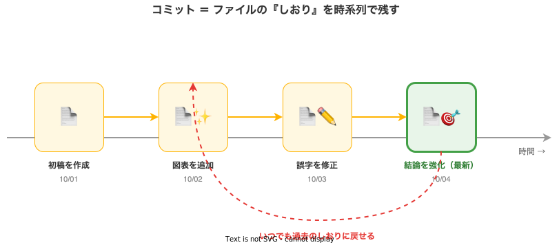
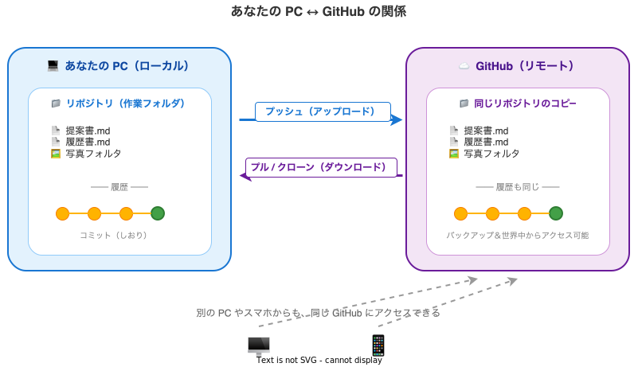

# なぜ GitHub を使うのか

このガイドでは、提案書・ポートフォリオ・行政手続きの書類などに Claude Code を使う方に向けて、**そもそもなぜ GitHub を組み合わせるのか** を分かりやすく解説します。

「リポジトリ」「コミット」など聞き慣れない言葉が出てきますが、難しい仕組みは Claude Code が代わりに操作してくれるので、**意味だけ理解できれば十分**です。

## GitHub をひとことで言うと

GitHub は、**ファイルの変更履歴を自動で記録してくれるオンライン保管庫**です。

ファイルを「いつ・誰が・どこを変えたか」がすべて記録され、いつでも過去の状態に戻せます。世界中のエンジニアがソースコードの管理に使っているサービスですが、文章ファイルや画像にも同じように使えます。

### Google ドライブ・Dropbox との違い

似たようなオンラインストレージとの違いを整理します。

| | Google ドライブ / Dropbox | GitHub |
|---|---|---|
| **主な用途** | ファイル共有・同期 | 変更履歴の管理 |
| **履歴の粒度** | 数日〜数十日分が自動保存 | **すべての変更**が永久に残る |
| **どこを変えたか** | ファイル単位 | **1 文字単位**で差分表示 |
| **公開機能** | リンク共有 | **Web サイトとして公開**可能（GitHub Pages） |
| **Claude Code との相性** | 連携には追加設定が必要 | **標準で連携**、コマンド一発で保存・公開 |

ざっくり言えば、Google ドライブが「**今のファイルを置いておく場所**」なのに対し、GitHub は「**過去から現在までのすべての変化を記録する場所**」です。

## Claude Code と組み合わせる 4 つのメリット

### 1. Claude が間違えても安心して戻せる

Claude Code はファイルを直接編集します。たまに「思っていたのと違う書き換え」をすることもありますが、GitHub に保存しておけば **数秒前の状態にワンコマンドで戻せます**。

「AI に任せて壊れたらどうしよう」という不安を、GitHub が肩代わりしてくれます。

### 2. PC が壊れてもファイルが消えない

GitHub に保存（プッシュ）しておけば、PC が壊れても・水没しても・買い替えても、**新しい PC で同じ作業を続けられます**。提案書や履歴書のように「絶対になくしたくないもの」ほど、GitHub に置く価値があります。

### 3. スマホや別の PC からも確認できる

GitHub に保存したファイルは、ブラウザから見られます。出先でスマホから「あの提案書の数字どうだったっけ」と確認したり、家の PC で書きかけたものを会社の PC で続けたり、といった使い方ができます。

### 4. ポートフォリオやサイトとして公開できる

GitHub Pages という機能を使うと、保存したファイルをそのまま **無料で Web サイトとして公開**できます。写真家のポートフォリオ、ライターの記事まとめ、自己紹介ページなどを、Claude Code に「公開して」と頼むだけで世界に届けられます。

!!! tip "このガイドのサイト自体も GitHub Pages です"
    今あなたが読んでいるこのページも、GitHub に保存されたファイルから自動生成されて公開されています。

## 最低限知っておきたい 3 つの言葉

Claude Code が代わりに操作してくれるので、意味だけ覚えれば OK です。

| 用語 | 普段の言葉に置き換えると | 何をするときに使うか |
|---|---|---|
| **リポジトリ** | プロジェクト用の**フォルダ** | 案件・テーマごとに 1 つ作る |
| **コミット** | **「ここまで OK」のしおり**を挟む | 区切りの良いところで保存 |
| **プッシュ** | GitHub に**アップロード**する | コミットしたものをオンラインに送る |

### 図解：コミットは「しおり」を時系列で残す

ファイルの編集途中に**コミット**を打つと、その時点のファイルの状態がまるごと「しおり」として残ります。後からどのしおりにでも戻せます。



### 図解：あなたの PC ↔ GitHub の関係

**リポジトリ**（フォルダ）は、あなたの PC と GitHub の両方に同じものが置かれます。**プッシュ**で PC → GitHub にアップロードし、**プル**または**クローン**で GitHub → PC にダウンロードします。



実際の使い方は、たとえばこんなイメージです：

```
あなた: 「ここまでの変更をコミットして、GitHub にも上げておいて」
Claude: （コミットとプッシュを自動で実行）
```

専門用語を打ち込む必要はなく、**日本語で意図を伝えるだけ**で動きます。

## Public（公開）と Private（非公開）の使い分け

GitHub のリポジトリには 2 種類あります。

| | Public（公開） | Private（非公開） |
|---|---|---|
| **見える人** | **世界中の誰でも** | あなたと招待した人だけ |
| **検索エンジン** | ヒットする可能性あり | ヒットしない |
| **向いているもの** | 公開したい作品・公開ブログ | 提案書・履歴書・下書き全般 |

!!! warning "原則 Private で作成してください"
    Claude Code の作業用リポジトリは、**必ず Private で作成してください**。

    一度 Public にしたファイルは、たとえ後で削除しても、誰かにダウンロード・キャッシュされている可能性があり、**完全に取り消すことはできません**。

### 公開して良いもの・悪いもの

| 公開しても良い | 公開してはいけない |
|---|---|
| 自己紹介サイト・ポートフォリオ作品 | クライアントの提案書・見積もり |
| 一般公開済みのブログ記事 | 履歴書・職務経歴書（連絡先入り） |
| OSS のソースコード | API キー・パスワード・認証トークン |
| | 顧客情報・社内資料 |

迷ったら **Private にしておく** のが安全です。

## 無料で使える範囲とデータの所在

### 料金

個人利用であれば、**ほぼすべての機能が無料**で使えます。

- Private リポジトリは**無制限**に作成可能
- ストレージは合計 1 GB 程度が目安（テキスト中心なら十分）
- GitHub Pages による Web 公開も無料

### あなたのファイルはどこに渡るのか

Claude Code を使うとき、ファイルが渡る相手は次の 2 者です。

| 相手 | 渡るもの | 何のため |
|---|---|---|
| **Anthropic（Claude の提供元）** | あなたが Claude に見せた**会話とファイルの内容** | AI が回答を生成するため |
| **GitHub** | あなたが**保存した**ファイル | バックアップ・履歴管理のため |

どちらも世界水準のセキュリティで運用されており、**Private リポジトリの中身が他人に見られることはありません**。Anthropic の利用規約・プライバシーポリシーや GitHub の規約で、個人ファイルの扱いは保護されています。

## 次のステップ

GitHub を使うイメージがついたら、実際にセットアップに進みましょう。

- **これから準備する方**: [macOS Part 1](../macos/part1-preparation.md) / [Windows Part 1](../windows/part1-preparation.md) で GitHub CLI のインストールとログインを行います
- **インストール済みの方**: [macOS Part 3](../macos/part3-post-setup.md) / [Windows Part 3](../windows/part3-post-setup.md) でリポジトリを作成し、Claude Code から使える状態にします
